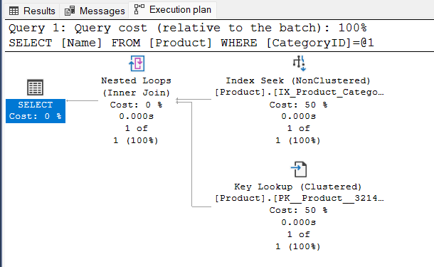
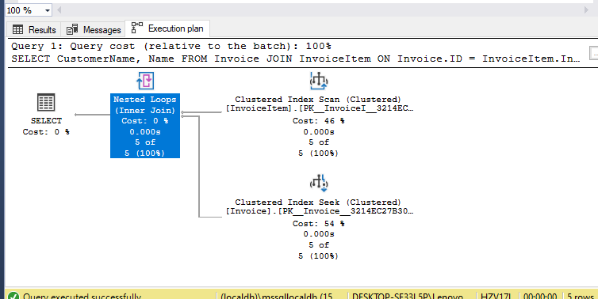

# Lekérdezés optimalizálás labor / Query optimization laboratory

## Feladat 1

A kiadott parancsok:

- `select * from customer`
- `select * from customer where id = 1`
- a többi is hasonló, csak az `id` mezőt használjuk

A lekérdezési terv mindegyikre nagyon hasonló, mindegyik _table scan_-t használt:

Magyarázat: az optimalizáló nem tud indexet használni, a tárolás sorrendjével kapcsolatban sem élhet feltételezéssel, így minden lekérdezés _table scan_ lesz.

## Következő nagyon izgalmas feladat

Add meg a használt SQL utasításokat. Ha egy feladatban nagyon hasonlóak (mint fentebb), nem szükséges mindegyiket megadod, csak jelezd 1-2 példával.

A kapott lekérdezési tervet képként tedd be. Ha a lekérdezési tervek nagyon hasonlóak (mint az első feladatban), elég csak egyet megmutatnod.

Értékeld a kapott tervet, magyarázd meg, mit látsz, és miért.

## Exercise 1

The SQL commands executed:

- `select * from customer`
- `select * from customer where id = 1`
- `select * from customer where id <> 1`
- `select * from customer where id > 1`

- execution takes same procedure for tasks a-d
- 
**Explanation:** the optimizer cannot use any index, as we removed both primary key and foreign keys from customer and customer site table so the only way is table scan.
- (e) `select * from customer where id > 1 order by id desc`

 .
**Explanation:** The difference here is that the query engine needs to sort the data in descending order. This requires a new sorting functional logic, as there is no index in the customer table.
___

## Exercise 2
The following queries are similar to Task 1:
- (f)`select * from customer`
- (g)`select * from customer where id = 1`
- (h)`select * from customer where id <> 1`
-(i) `select * from customer where id > 1`
-(j) `select * from customer where id > 1 order by id desc`
- **(f)**

  

   **Explanation:**
    
    To iterate through the table, the Clustered Index Scan can be used, which involves utilizing the automatically created Clustered Index for the primary key that sorts records by ID. By traversing this index, all records are visited, which is a process that is similar to a Table Scan, albeit less efficient. Nonetheless, this is the requested approach for the task at hand..

- **(g)**

 

   **Explanation:** Opting for a Clustered Index Seek would suffice in this scenario. Given that the filter criteria is based on the ID column, which already has an available index, the matching record can be located rapidly. This plan is highly efficient since the Clustered Index is being utilized for the precise purpose it was created for..

- **(h)**

    **Explanation:**
    
    To retrieve data within two specific intervals (< constant, > constant), a Clustered Index Seek can be used. As the filter criteria still pertains to the ID field and a Clustered Index has been implemented, this index will be utilized for the query. This approach is highly efficient and will result in improved query performanc

- **(i)**

  **Explanation:** Similar to previous one.

- **(j)**

 
 
  **Explanation:**
    
    In this part, sorting is skipped. The reason is that the engine will try to find the last matching record, and as it's indexed, we can see that by moving backward on data, it will return our desired output. It is obvious that in ordering from descending to ascending, this scan direction will be forward..

___

## Exercise 3

**SQL Commands:**

- (f) `select * from Product`
- (g) `select * from Product where price = 800`
- (h) `select * from Product where price <> 800`
- (i) `select * from Product where price > 800`
- (j) `select * from Product where price > 800 order by price desc`

**Query Description:**

- ***(f-i)***

**Explanation:** 

When there is no index available to match the filter criteria, a Clustered Index Scan is used to iterate through the index contents. However, this approach is still equivalent to reading the entire table since the existing Clustered Index does not serve any purpose in filtering. As a result, all records are visited, and the filter is evaluated for each. Unfortunately, this approach is not efficient for queries, as the available index is not of any use.

- ***(j)***

**Explanation:**
Despite being a Clustered Index Scan, what is noteworthy is the high cost associated with the sorting stage. Even after executing the costly Index Scan, there is still a substantial amount of sorting required. While a suitable index could potentially help alleviate this issue, unfortunately, there is no index available for the sorted column.

___
## Exercise 4

**SQL Commands:** The SQL commands executed are same as Exercise 3.

**Query Description:**

- **(f)**

 

  **Explanation:** 
    Although a new index has been created, the approach for retrieving the entire table contents remains an Index Scan, as this is the approach that was requested. The  new index may assist in improving query performance, but the underlying approach for retrieving the data remains an Index Scan.

- **(g-i)**

- 

    **Explanation:**
    Although a new index is available for the filtered column, the Clustered Index Scan still iterates through the entire table, as if no index was present. The reason for this is the projection, where the entire record is being queried. While a NonClustered Index could potentially yield a set of record identifiers, the actual records would still need to be queried afterwards. The query optimizer has determined that this approach is not worthwhile, and instead, an Index Scan is the more efficient option. 

- **(j)**
- 

    **Explanation:** as can be seen in screenshot there is a nested Loops(inner join) because we have a non clustered index an trying to find suitable data with where conditon and then sorting them its a process similar to join , so first we look throw whole table as clustered ibndex then we need to sort but when we ha ve a non ckustered index its a diffrent stage and quert for system
    ___

## Exercise 5

**SQL Commands:** The SQL commands executed are same as Exercise 3.

**Query Description:**

- **(f)** : Same as previous task.

- **(g)**

 **Explanation:**
When comparing the plan for a smaller table to the previous one, we notice that the Clustered Index Scan is not used. The selectivity, or the number of matching records, becomes more crucial in larger tables, making the Clustered Index Scan too expensive. The NonClustered Index can limit the number of records, making it more useful in this scenario. However, it's important to note that even though the comparison operator is "=", it doesn't necessarily mean that there are few matches. The statistics of the Price column are crucial in this case. This query is acceptable because the index is utilized to reduce the number of records.s.

- **(h)**

 
 
 
***Clustered Index Scan as before***

   **Explanation:**  The current scenario involves using the <> operator for filtering, which is likely to yield many matches based on the statistics of the column being filtered. This is in contrast to the previous scenario where the = operator was used, and the filtering resulted in few matches. In this case, using the same approach as before, i.e., using a NonClustered Index Seek, may not be efficient as it may still involve a large number of record lookups. Therefore, using a Clustered Index Scan to iterate through the entire table may be a more efficient approach.

- **(i)**

The plan depends on the constant. If it yields few matches, similar to (g); otherwise the same as in (h).

- **(j)**

 

   **Explanation:** similar to part (g) The order by desc does matter here because it changes the order in which the records are returned. However, in terms of query optimization, using the NonClustered Index to avoid a separate sorting stage is the main consideration. So while the order by desc affects the output of the query, it doesn't affect the efficiency of the execution plan.

___
## Exercise 6

**SQL Commands:**
- (f) `select ID , Price from Product`
- (g) `select ID , Price from Product where price = 800`
- (h) `select ID , Price from Product where price <> 800`
- (i) `select ID , Price from Product where price > 800`
- (j) `select ID , Price from Product where price > 800 order by price desc`

**Query Description:**

- **(f)**
- 

    **Explanation:** 
    Non clustered is prefered by optimiser as we only look up over id and price 

- **(g)**
- 

    **Explanation:**
    again Non clustered index is using because we have index on price so there is no need to iterate whole table to search all columns

- **(h)**
- 

    **Explanation:** here we skip only price 800 and we need to return all search result which is a big set of data for this reason optimiser is doing non clustered index search

- **(i)**

    **Explanation:** similar to part (f)

- **(j)**

 

   **Explanation:** Nonclustered Index  was used here, same as before. The sorting part can be seen in properties because the scan direction was backwards.

___
## Exercise 7

**SQL Description:**

  - **(k) :** `select * from product where id between 5 and 10`
  - **(l) :** `select * from product where id between 5 and 10 or id=1`

**Query Description:**

- **(k)**

 

   **Explanation:** :
   
   Here _Clustered Index_ is being used because we are fitering over id which is clustered.
   
   
- **(l)**

 
 
 
   **Explanation:** its similar to K
   
   
    ___

## Exercise 8

**SQL Commands:**

  - **(m) :** `SELECT ID , Price FROM Product WHERE CAST(Price AS INT) = 1000;`
  - **(n) :** `SELECT ID , Price FROM Product WHERE Price BETWEEN 999.9999 AND 1000.0001;`

**Query Plans:**

- **(m)**
- 

    **Explanation:**
    Here non clustered index used but at first stage type is converted to integer.

- **(n)**
- 

    **Explanation:** 
    again non clustered index but diffrence is that it didnt convert as we defined type in query
___
## Exercise 9

**SQL Commands:**

  - **(o) :** `select * from product where price < 2 order by ID desc`
  - **(p) :** `select id,price from product where price < 2 order by ID desc`
  - **(q) :** `select * from product where price > 100 order by ID desc`
  - **(r) :** `SELECT ID, Price FROM Product WHERE Price > 100 ORDER BY ID DESC;`

**Query Description:**

- **(o)**

 

   **Explanation:** 
   
    Non clustered is used to search for matched columns and a clustered to search throw records and then sort function is applied.

- **(p)**

 

   **Explanation:** 
    Here same as task _O_ but diffrence is there is no clustered index as only query over ID and Price and sorting function is applied on ID column which has a Clustered Index.

- **(q)**

 

   **Explanation:**
    We can see here query execution time is over 1 minute which probably not optimal but proves high amount of data , Clustered index is used as we iterate whole table and then sort by id , the reason optimmiser choosed Clustetered is high number of output

- **(r)**

 

   **Explanation:** 
    this is exactly same as task _q_ but its just shorter in time because we filter over ID and Price but due to large output optimiser will choose clustered.

___

## Exercise 10

**SQL Commands:**

  - **(s) :** `SELECT ID, Name FROM Product WHERE SUBSTRING(Name, 1, 1) = 'B';`
  - **(t) :** `SELECT ID, Name FROM Product WHERE Name LIKE 'B%';`
  - **(u) :** `select name,id from Product where name LIKE '%B%'`
  - **(v) :** `SELECT ID FROM Product WHERE Name = 'Colorful baby book'`
  - **(w) :** `SELECT ID FROM Product WHERE UPPER(Name) = 'Colorful baby book'`

**Query Description:**

- **add a new index on Product , Name column:**

`CREATE INDEX idx_Product_Name ON Product(Name);'`

- **(s)**

 
 
 
   - **Explanation for Query:** : This query retrieves the IDs and names of all products where the name begins with the letter 'B' using the SUBSTRING function. The execution plan will depend on the size of the Product table and the selectivity of the query. However, the newly created index on the Name column should help optimize this query.

   **Explanation:** NonClustered Index  is used as we created a NonClustered Index for Name column. Since the output only requires name and id, Nonclustered Index is used. Also.

- **(t)**

   - **Explanation for Query:** This query retrieves the IDs and names of all products where the name begins with the letter 'B' using the LIKE operator. This query is similar to the previous one, but using LIKE instead of SUBSTRING. The execution plan will also depend on the size of the Product table and the selectivity of the query. However, the newly created index on the Name column should also help optimize this query.

   **Explanation:** _NonClustered Index Seek_ is used here because we only need to know what starts with B.

- **(u)**

 

   **Explanation for Query:**
    
    This query retrieves the IDs and names of all products where the name contains the letter 'B'. This query uses the LIKE operator to match the 'B' character anywhere in the Name column. The execution plan will depend on the size of the Product table and the selectivity of the query. The newly created index on the Name column will help optimize this query, but it may not be as effective as for the previous queries due to the wildcard character (%) used in the LIKE condition.

   **Explanation:** 
    Non clustered index search is used becasue we are seacrchin if Name contais letter _B_ optimiser will lookup throw each row which is an index scan

- **(v)**

 

   **Explanation:** NonClustered Index is used here. the newly created index on the `Name` column should be very effective in optimizing this query.As we are itterating only over Name

- **(w)**

 

   **Explanation:** Non cluster is used since we need to convert each name to upper to get output

    ___

    ## Exercise 11

**SQL Commands:**

  - **(x) :** `SELECT MAX(ID) FROM Product;`
  - **(y) :** `select MIN(price) FROM Product`

**Query Description:**
- **(x)**

 

   **Explanation:** The clustered index scan operator reads all the rows in the Product table, and for each row, it returns the value of the `ID` column. The top operator then takes the first row returned by the scan operator (since the TOP expression is (1)), and passes it to the `stream aggregate` operator.The stream aggregate operator computes the maximum value of the `ID` column, as requested by the query, and returns it as a single row with a single column.The plan has a low estimated cost, which indicates that it is an efficient plan for this query. also scan direction is backward

- **(y)**

 

   **Explanation:** NonClustered Index is used here because our Price column has a nonclustered index.The estimated cost of executing this query is very low (0.00328468), indicating that the query is very efficient and should complete quickly.
___
## Exercise 12

**SQL Commands:**

  - **(Z) :** `SELECT CategoryId, COUNT(*) AsNumberOfProducts
FROM Product
GROUP BY CategoryId;`

**Query Description:**
- **(Z)**

 

   **Explanation:**  Clustered Index is used here as we iterate throw IDs to find total number of products, which is an indexed column.`hash match` operation is used to group the products by their category `ID` in the `Product` table, which is performed by building a hash table on the `CategoryId` column and then scanning the table to identify the matching rows
   
___

## Exercise 13

**SQL Commands:**

 - **(Z1) :** `select COUNT(id) from Product group by CategoryID`
   - **(Query to create index on categoryID) :**    `CREATE INDEX idx_CategoryId ON Product(CategoryId);`
    
    - ***Query Explain:*** To improve the performance of the given query, we can add an index on the CategoryId column of the Product table. This will allow the database engine to quickly group the rows based on the CategoryId column and count the number of products in each category without having to perform a full table scan.

**Query Description:**

- **(Z1)** 

 
 
   **Explanation:** .We replace the heavily Hash Aggregate with an unclustered index on categoryID then optimiser can use Stram AggreGate so it is sorted by CategoryID

___

## Exercise 14

**SQL Commands:**

  - **(Z2) :** `select Name from Product where CategoryID=2`

**Query Description:**

- **(Z2)**
  
 

   **Explanation:** 
    Non clustered is used to look for `category id` as we have index there and clustered to look throw `name`
    ___
    
    
## Exercise 15

**SQL Commands:**

  - **(15) :** `select Name from Product where CategoryID=2`

**Query Description:**

- **(15)**

 

   **Explanation:**
    Only Non clustered is used as we added a new index on name so no need to key look up on name
___

## Exercise 16(optional)

**SQL Commands:**

  - **(16) :** `SELECT CustomerName, Name`
              `FROM Invoice JOIN InvoiceItem ON Invoice.ID = InvoiceItem.InvoiceID`

**Query Description:**

- **(16)**
- 

    **Explanation:** The system chose the Nested Loops join strategy to execute the given query , The Nested Loops join strategy is typically used when one of the input sets is very small or can be indexed, and the other input set is relatively larger.we can see that the optimizer has estimated that only 5 rows will be returned by the query, which is also in favor of using Nested Loops join as it is efficient for smaller data sets.

